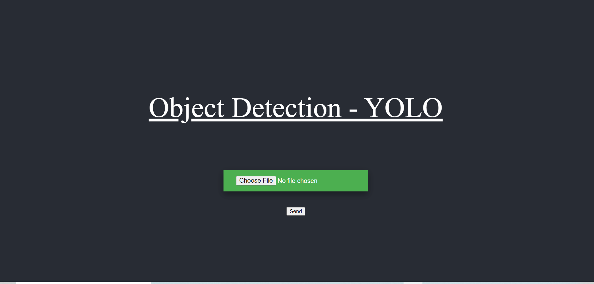
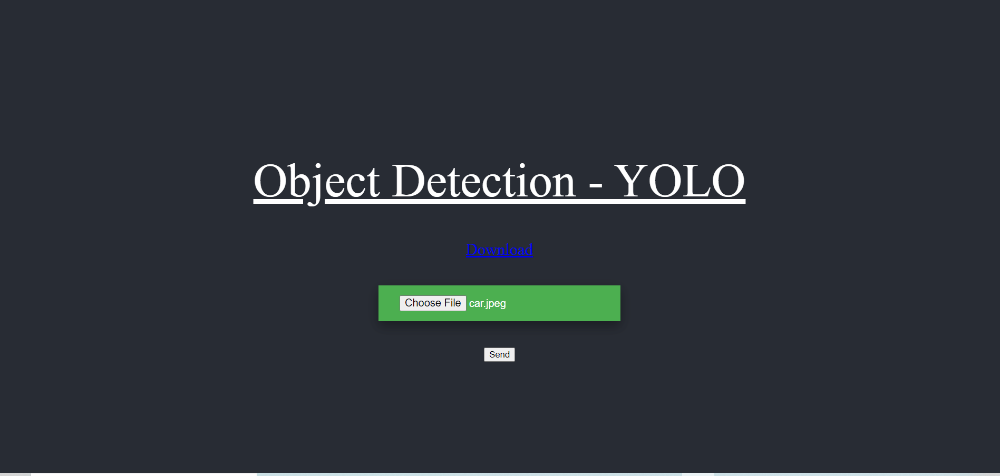
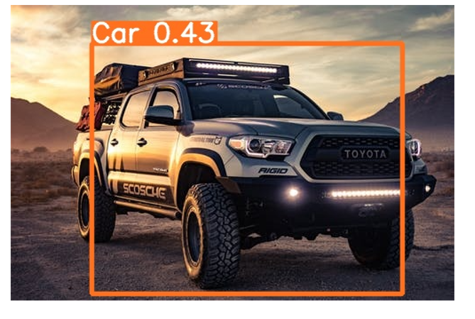

# Vehicle-detection-with-yolov5
Detecting the vehicles like car , truck , ambulance using yolov5


# How to use this project

Clone this repo using the command 
```bash
git clone https://github.com/kkkumar2/Vehicle-detection-with-yolov5.git
```

# Webapp loading page

Upload the image or video and click send


Once you get the download button visible click on download


Download the image to get the Predictions which are shown below 



Video Predictions are shown below 
https://user-images.githubusercontent.com/88458239/163666098-b9b7f67e-686c-4309-a055-67ea55f345ea.mp4

